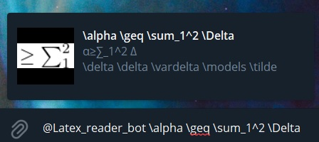
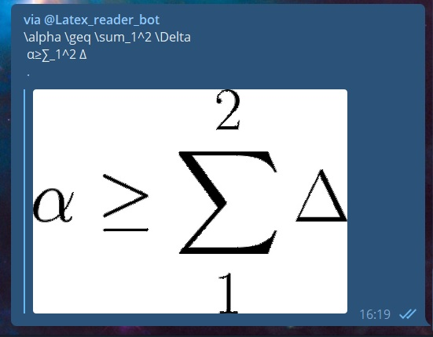
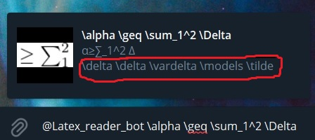
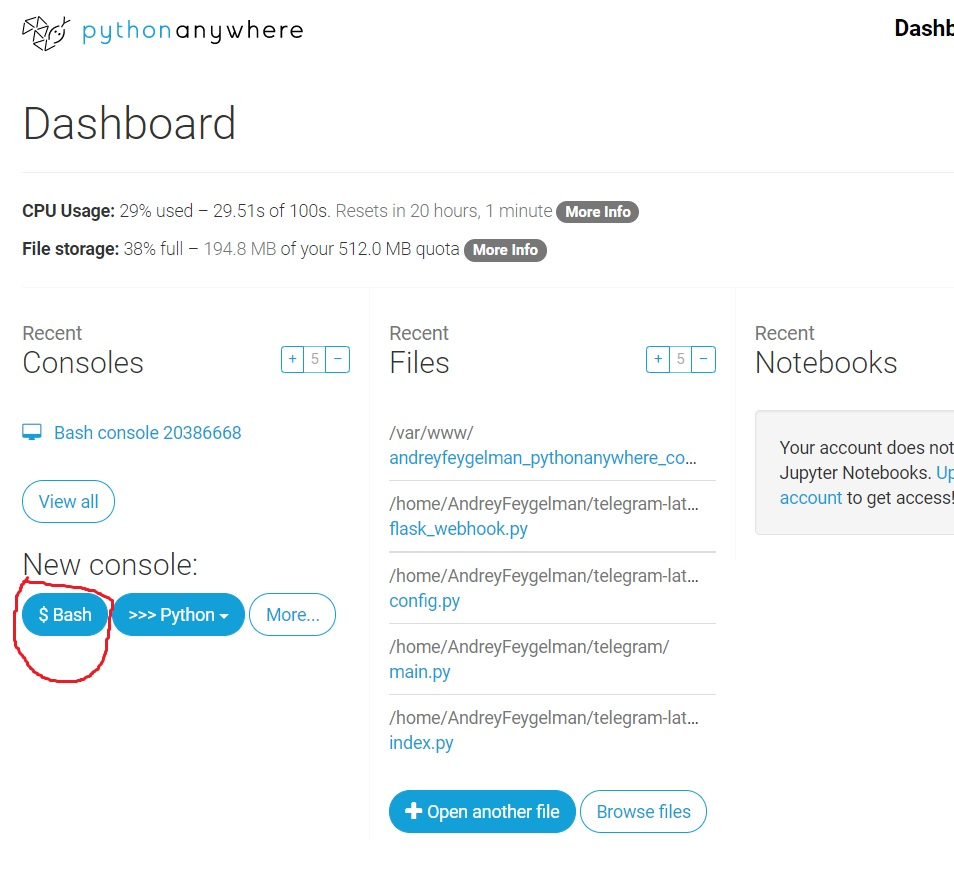
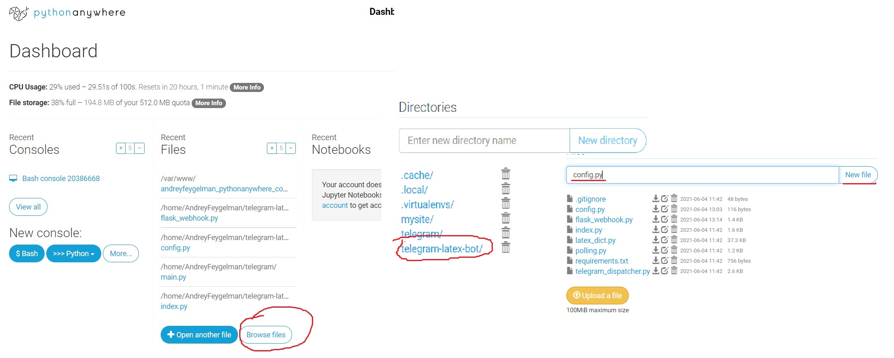
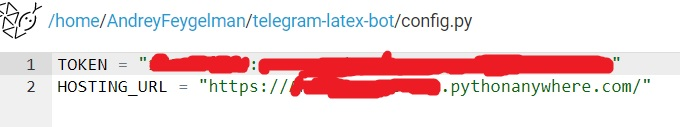

# Description
This is simple telegram messanger [inline bot](https://core.telegram.org/bots/inline) for typing latex code in any chat  

Can be called from any telegram by typing "\<bot alias\> \<request\>" in any chat  

Currently (hopefully) hosted on [pythonanywhere](https://www.pythonanywhere.com/) [`@Latex_reader_bot`](http://t.me/Latex_reader_bot) using webhooks




# File Structure
This project basically has 2 enty points: `flask_webhook.py` and `polling.py`

### `flask_webhook.py`

A flask application and an entry point for webhook based bot

### `polling.py`

Entry point for polling based bot

### `telegram_dispatcher.py`

Contains the logic of interaction with telegram

### `index.py`

Contains the logic of creating index for latex commands suggestions



### `latex_dict.py`

contains data for `index.py`, WIP

# Deployment

## Pythonanywhere on webhooks

After you create account and open dashboard you should find a button to open a new bash console. 

```bash
git clone https://github.com/Andrey862/telegram-latex-bot
pip3.8 install --user -r requirements.txt
```

Then go to telegram-latex-bot directory and create config.py there



Put in config.py your telegram tocken and your website url


```Python
TOKEN = "<Your token here>"
HOSTING_URL = "https://<your username here>.pythonanywhere.com/"
```

Then click on "Web" in navigation bar and then:
- "Add a new web app"
- "Manual configuration"
- "Python 3.8"

Find "code section"

change Source code line to "telegram-latex-bot"

Change WSGI configuration file to the next 
Put your sourse code path into project_home variable
```Python
import sys
project_home = "/home/<your pythonanywhere username>/telegram-latex-bot"
if project_home not in sys.path:
    sys.path = [project_home] + sys.path
from flask_webhook import app as application  # noqa
```

And enjoy your bot!

## Heroku on polling

Assuming you already have heroku installed on your machine,   
Run from terminal:

```bash
git clone https://github.com/Andrey862/telegram-latex-bot
cd telegram-latex-bot
heroku apps:create telegramLatexBot
heroku config:set TOKEN=<YOUR TOKEN HERE>
git push heroku master
heroku scale worker=1
```